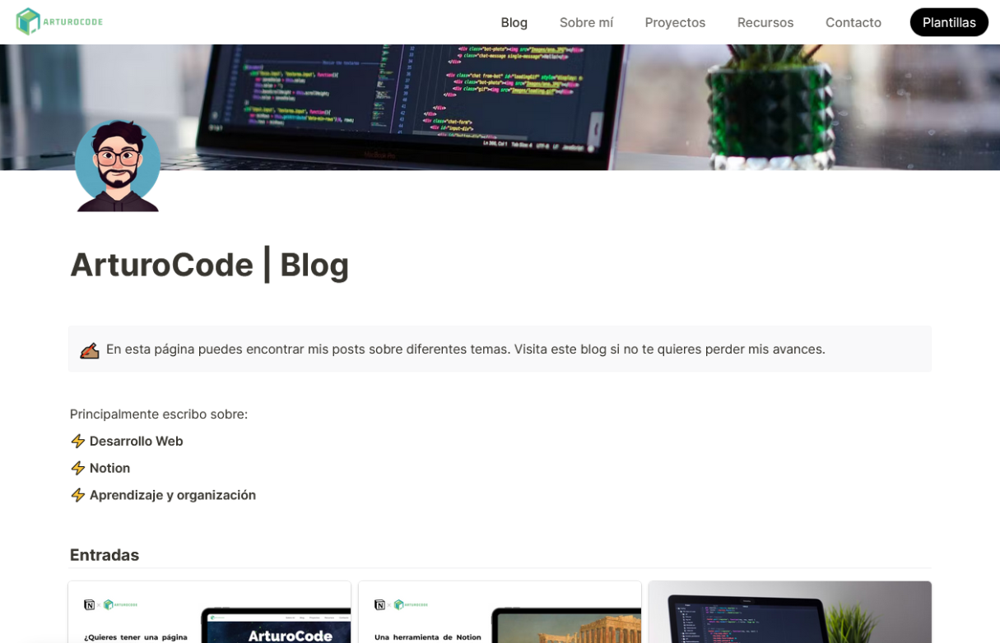
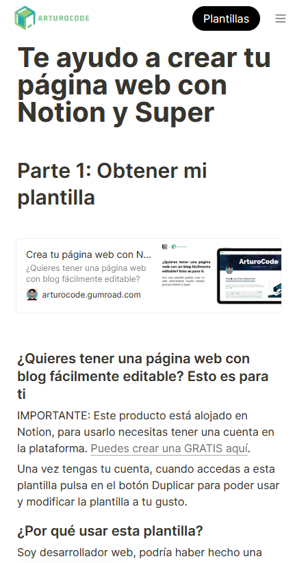

# Blog Tech | ArturoCode

Un sitio web de un blog minimalista para escribir y publicar de forma rápida y visual tanto artículos como recursos útiles de tecnología.

Es una página realizada con Super y Notion y aunque en este caso solo consiste en un blog, puede ser una web completa fácil de mantener para un usuario común ya que no se necesitan conocimientos de código (No-Code) si no quieres personalizarlo de forma avanzada.

Si quieres saber como hacerte una página como esta, lee [este artículo.](https://arturocodeblog.super.site/entradas/te-ayudo-a-crear-tu-pgina-web-con-notion-y-super)

<table>
    <tr>
        <td></td>
        <td></td>
    </tr>
</table>

